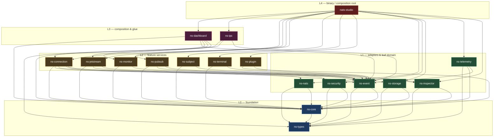
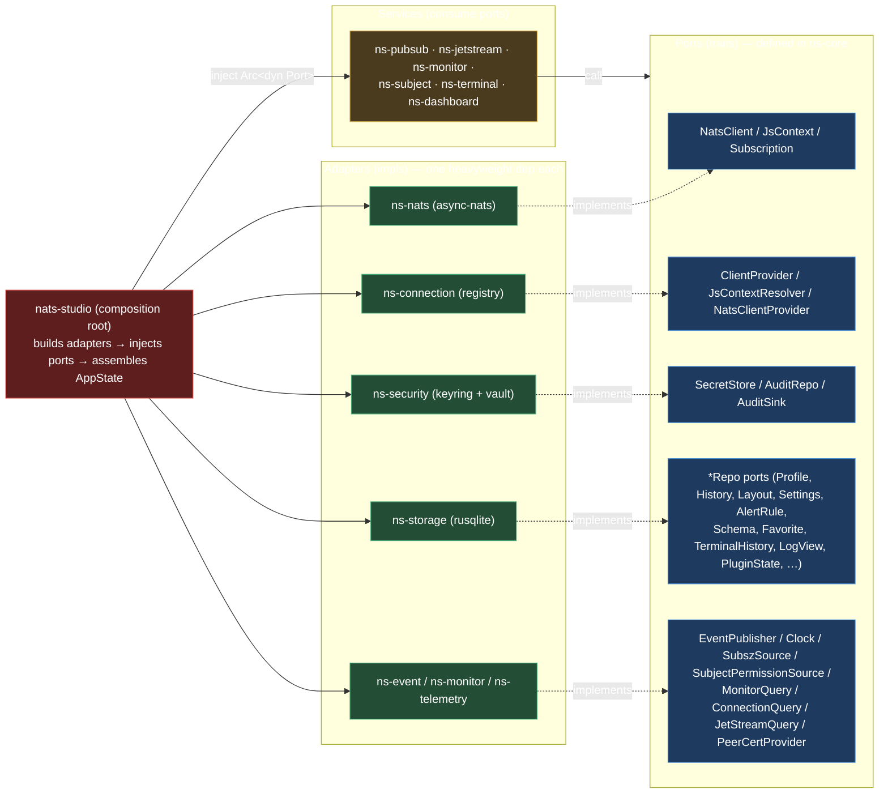
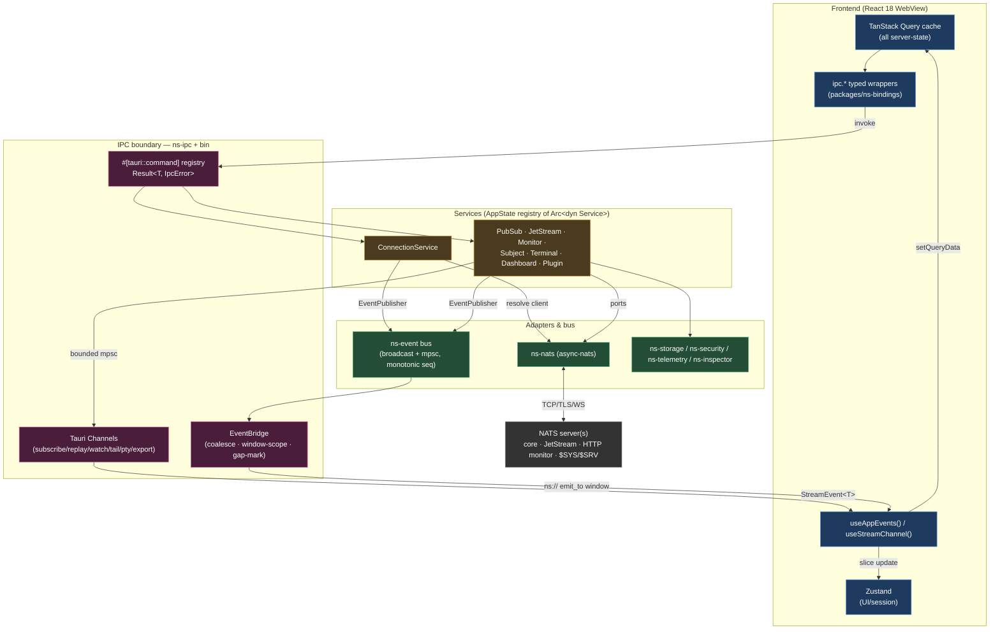

# NATS Studio — Dependency & Interaction Graphs

> Document ID: `arch/dependency-graph`
> Status: **ACCEPTED (v1.0)**
> Owner: Principal Architect
> Binds to: [`README.md`](./README.md), [`00-conventions-and-workspace.md`](./00-conventions-and-workspace.md)

This document is the authoritative visual model of how the crates depend on each other (layered and **acyclic**) and how the subsystems interact at runtime. The edges here reflect the [reconciliation decisions](./README.md#8-reconciliation-decisions) — notably that the `NatsClient`/`JsContext` **ports live in `ns-core`** (ADR-0021), that `ns-ipc` keeps an L0-only dependency set (the aggregate `AppError` lives in the bin), and that no L2 feature crate depends on another L2 or on L3 `ns-dashboard`.

`cargo xtask check-layers` enforces this graph in CI: any edge that points "upward" or forms a cycle fails the build.

---

## 1. Crate dependency graph (layered, acyclic)

Edges point from a crate to the crate it depends on. Every arrow flows **downward** across layers (L4 → L3 → L2 → L1 → L0). There are no upward or lateral edges except the explicitly-allowed L3 `ns-dashboard` → L2 composition.

> `ns-types` and `ns-core` carry all `EventPayload`/`ErrorCode`/DTO edges implicitly — every crate depends on them. `ns-testkit` (dev) depends on `ns-types`, `ns-core`, `ns-nats` and is a `dev-dependency` of every crate; it is omitted above to keep the production graph clean.

### 1.1 Why the "surprising" edges are absent

| Edge you might expect | Why it does **not** exist | Where the coupling actually lives |
|---|---|---|
| `ns-jetstream → ns-monitor` | JS account limits come from `$JS.API.INFO` via `JsContext`. | `JetStreamQuery` port; dashboard composes at L3. |
| `ns-jetstream/ns-monitor → ns-dashboard` | Composition is one-way; L2 never depends on L3. | `ns-dashboard` pulls via `MonitorQuery`/`JetStreamQuery`/`ConnectionQuery` ports. |
| `ns-pubsub → ns-jetstream` | JS publish uses `JsContext` from a resolver port. | `ClientProvider::js()` port in `ns-core`. |
| `ns-monitor → ns-nats` | `NatsClient` is a **port in `ns-core`** (ADR-0021). | `NatsClientProvider` port; `ns-nats` impl injected by the bin. |
| `ns-ipc → ns-connection/...` (L2 errors) | `to_ipc_error` takes `&dyn DomainError`. | Aggregate `AppError` lives in the **bin**. |
| `ns-inspector → ns-pubsub/ns-plugin` | Inspector is L1; plugins register codecs via a port. | `register_codec(Arc<dyn Codec>)` called by bin/host. |
| any crate (except `ns-nats`) importing `async-nats` | Source-import confinement (ADR-0001). | Only `ns-nats` `use async_nats`. |

---

## 2. The port-injection pattern

Feature services never construct infrastructure. The bin builds adapters and injects them as `Arc<dyn Port>`. This is what keeps the graph acyclic and every service headless-testable.

---

## 3. Runtime subsystem interaction

How a live connection's data flows from NATS to the WebView and back. The **`EventBridge` is the only bus→Tauri translator**; request-scoped streams use Tauri **Channels**; all commands cross the `ns-ipc` boundary.

### 3.1 The two streaming mechanisms (ADR-0009)

| Mechanism | Used for | Lifecycle | Backpressure |
|---|---|---|---|
| **Tauri Channel** (`Channel<StreamEvent<T>>`) | Request-scoped streams tied to one call: subscribe, replay, KV/object watch, backup/restore/transfer, terminal PTY, log tail, subject sampling, export. | Bound to the initiating view; `*_cancel`/`*_unsubscribe` trips the token; Channel-drop watchdog cancels leaks. | Bounded buffer + per-stream policy (sample+count / preserve-order+overflow marker). |
| **Bridged Tauri event** (`ns://…`) | Ambient app-wide broadcasts many screens observe: connection status, metrics ticks, stream/consumer updates, notifications, plugin/security/dashboard signals. | App-lifetime; multiplexed through the single `EventBridge`. | Per-topic coalescing (keep-latest / dedupe / rate-limit / never-drop) in the bridge; `Lagged(n)` → synthetic gap event. |

---

## 4. Acyclicity invariants (CI-enforced)

1. **No upward edges.** A crate may depend only on strictly lower layers (plus `ns-types`/`ns-core`). The single allowed intra-tier composition is L3 `ns-dashboard` → L2 services.
2. **No L2 ↔ L2 edges.** Feature services communicate only through `ns-core` ports and `ns-types` DTOs, never by depending on each other.
3. **Single-import confinement.** `async-nats` only in `ns-nats`; SQL only in `ns-storage`; `keyring` only in `ns-security`; `reqwest` only in `ns-monitor`; `portable-pty` only in `ns-terminal`; `tauri` only in `ns-ipc` + the bin.
4. **Ports down, adapters up, wiring in the bin.** Trait definitions live in `ns-core`; implementations live in the adapter crates; the only `new_*()`/injection site is `nats-studio`.
5. **`ns-types` is frozen.** Additive-only; breaking changes require an ADR + `appSchemaVersion` bump (ADR-0006).
